<div align="center">


# 🎯 RATISS-FOCAL — Focalisation informationnelle

**La cohérence émerge-t-elle de l'information ? Ici, on ne spécule pas : on mesure.**

[](LICENSE)
[](PROTOCOLES.md)
[](UNIFICATION.md)
[](organes/)
[](organes/)

*Par **RATISS Labs** — Jonathan Evina · Licence MIT · Reproductibilité publique totale*

</div>


> **Abstract (EN).** *Does coherence emerge from information? RATISS-FOCAL is an open experimental
> program (69 pre-registered computational tests plus 15 open explorations, 13 unification releases) probing whether coherent
> structure can arise from pure information — with zero neurons. Three sectors are characterised:
> **G** (informational gravity: plastic, scarring, saturating on an absolute core of 0.083),
> **Q** (quantum memory: an anti-persistent continuum, phase-steerable), and **U** (primitive
> entanglement: a sanctuary robust to discrete shocks, eroding past ambient noise σc = 0.06,
> irreversibly). Every equation ships with its test. Failures are published, never hidden. MIT.*

---

## 📖 Sommaire

1. [La question](#-la-question)
2. [Les trois piliers : G, Q, U](#-les-trois-piliers--g-q-u)
3. [Résultats majeurs (données réelles)](#-résultats-majeurs-données-réelles)
4. [Méthode : rigueur pré-enregistrée](#-méthode--rigueur-pré-enregistrée)
5. [Architecture du dépôt](#-architecture-du-dépôt)
6. [Démarrage rapide](#-démarrage-rapide)
7. [Carte des 12 versions](#-carte-des-12-versions)
8. [Ce que ça ouvre](#-ce-que-ça-ouvre)
9. [Lire dans l'ordre](#-lire-dans-lordre)
10. [Phase 17 : explorations](#-phase-17--explorations--sonde-uktz-ruq-test-6472)
11. [Phase 18 : singularité V13](#-phase-18--v13-singularité-test-7378)
12. [Phase 19 : QM-GR, cohabitation décrite](#-phase-19--qm-gr-cohabitation-décrite-test-7989)
13. [Phase 20 : LIAISON chasse au pli](#-phase-20--liaison--chasse-au-pli-test-9092--pont-berry)
14. [Citation, auteur, licence](#-citation-auteur-licence)

---

## ❓ La question

> **La cohérence émerge-t-elle de l'information ?**

Pas de la matière. Pas du calcul neuronal. De **l'information pure** : des points, des liens,
des concentrations — observés à travers un microscope topologique (homologie persistante),
sans un seul neurone.

Si une structure cohérente **apparaît, persiste et résiste aux destructions** dans ce milieu
minimal, alors la cohérence n'est pas un accident de la complexité : c'est une **propriété
de l'information elle-même**.

Ce dépôt est le laboratoire où cette question a été posée **63 fois**, avec des critères
écrits **avant** chaque mesure — et où les réponses, bonnes ou mauvaises, ont toutes été publiées.

## 🔱 Les trois piliers : G, Q, U

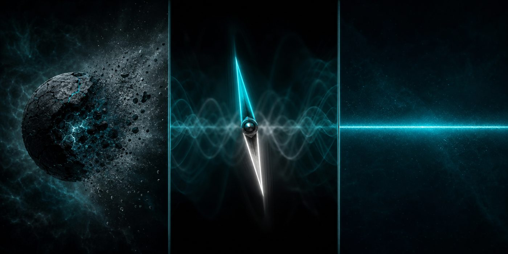

| Secteur | Nature | Personnalité mesurée |
|---|---|---|
| **G** — gravitation informationnelle | Contraction α d'un tore de points | **Plastique et mortel.** S'effondre au premier choc (0.345 → 0.097), saigne lentement (τ ≈ 400 pas), mais **sature sur un noyau absolu indestructible : 0.083**. Porte les cicatrices éternellement. |
| **Q** — mémoire quantique (anneau Kuramoto) | Synchronisation de 24 oscillateurs | **Girouette anti-persistante.** Pas d'attracteurs : continuum [0.76, 0.91], flip contrariant symétrique à chaque choc — mais **pilotable à P = 1.0 par la phase absolue injectée**. Le choc la blanchit (reset entropique), elle régénère. |
| **U** — intrication primitive | Ligne invisible : coïncidences non-géométriques | **Sanctuaire conditionnel.** Inchangé sous 7 chocs cumulés (28/30, Δ = 0) quand G meurt à −72 %. Mais sensible au **bruit ambiant** : seuil **σc = 0.06** (sigmoïde R² = 0.964), plancher partiel ~30 %, **érosion irréversible**. Lit la *texture* du bruit, pas seulement son volume. |

**En une phrase :** G est le terminal mortel, Q la mémoire régénérative, U le Fil qui persiste —
tant que l'environnement reste sous σc.

## 📊 Résultats majeurs (données réelles)

Toutes les figures ci-dessous sont générées **à partir des JSON de résultats** du dépôt
(script : `images/make_figs.py`).

### 1. Le sanctuaire U a un seuil : σc = 0.06

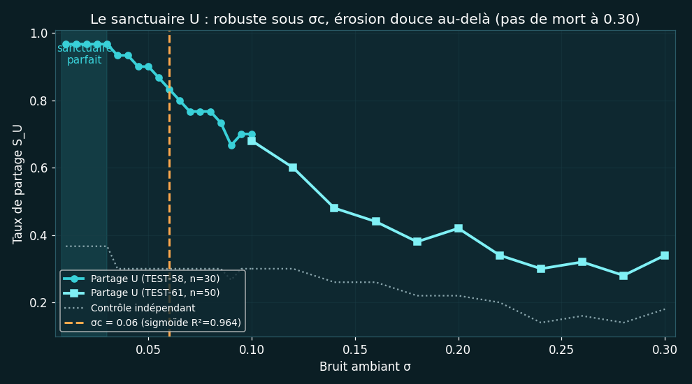

- **TEST-49** : 28/30 identiques sur 7 niveaux de chocs cumulés (Δ = 0) → sanctuaire absolu vs traumas.
- **TEST-58** : scan σ ∈ [0.01, 0.10] → sigmoïde R² = 0.964, σc = 0.06, plateau 29/30 → 21/30.
- **TEST-61** : pas de mort jusqu'à σ = 0.30 (plancher ~30 % vs ~16 % contrôle) mais **irréversible**.
- **TEST-62** : à σ identique, la structure HIGH porte U à +2/+4 → **U lit la texture du bruit**.

### 2. G sature sur un noyau absolu : 0.083

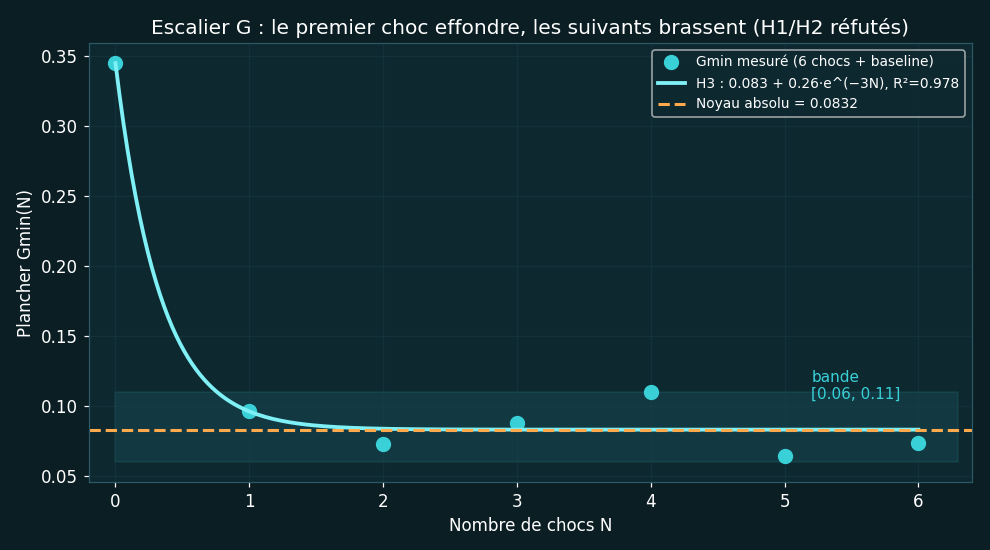

- **TEST-48** : 6 chocs cumulés → **H3 saturante R² = 0.978**, Gmin(N) = 0.083 + 0.26·e^(−3N).
- Le premier choc fait tout l'effondrement ; les suivants brassent dans une bande [0.06, 0.11].
- H1 (linéaire) et H2 (exponentielle) **réfutées** : pas de rupture vers zéro.

### 3. Le flip Q obéit à la phase : P = 1.0

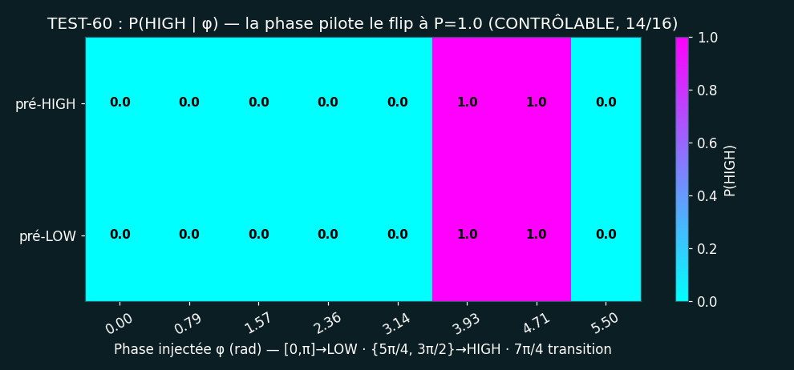

- **TEST-60** : φ_inj ∈ [0, π] → LOW, φ ∈ {5π/4, 3π/2} → HIGH, **P = 1.0 dans les deux bras pré-choc** (CONTRÔLABLE, 14/16).
- 7π/4 = zone de transition (50 % ambiguë) : la frontière du contrôle est visible.
- L'anti-persistence a un volant : la **phase absolue** (symétrie brisée par les ancres spatiales).

### 4. Q n'a pas d'attracteurs : continuum réfuté proprement

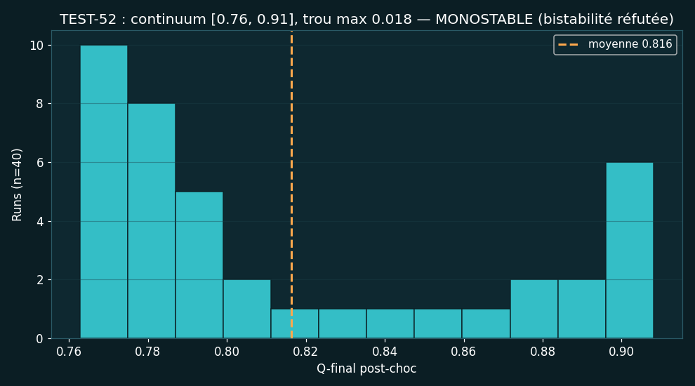

- **TEST-50** (n = 6) suggérait une bistabilité 0.78/0.87 → **TEST-52** (n = 40) la réfute : continuum
  [0.76, 0.91], trou max 0.018 (MONOSTABLE).
- **TEST-53** : P_switch = 1.0 dès 0.25× l'intensité standard → bassin sans profondeur.
- **TEST-56** : flip **symétrique** (HIGH→0.77, LOW→0.84) → pas de dérive, pas d'équilibre Q̄.
- *Leçon scellée dans le marbre : répliquer avant de nommer.*

### Autres lois scellées

| Loi | Test | Mesure |
|---|---|---|
| Plancher G(α, σ, N) = exp(−0.29 − 7.16α − 6.59σ + 0.0012N) | TEST-40 | R² = 0.920 |
| Reconstruction G double-exp, τ_lent ≈ 400 pas, plancher vrai 0.095 | TEST-46 | R² = 0.902 |
| Sync Q double-exp (k₁ = 0.098 rapide, k₂ = 0.001 lent) | TEST-36 | R² = 0.968 |
| Volatilité Q structurée (pente −0.72, ac1 0.63) | TEST-37 | signal, pas bruit |
| Proximité-Condensation (ρc = 8.01 extrait, jamais supposé) | TEST-27 | sync 0.98 vs 0.11 |
| Résilience post-collapse (liens : R = 1.023 absolue) | TEST-28/25 | purification réelle |

## 🔬 Méthode : rigueur pré-enregistrée

Ce qui distingue ce dépôt n'est pas qu'il a raison — c'est **qu'il ne peut pas tricher** :

1. **Critère écrit avant la mesure.** Chaque TEST déclare sa règle de succès dans son docstring
   *avant* exécution. Pas de seuil ajusté après coup.
2. **Falsifiabilité obligatoire.** Chaque test a au moins deux issues possibles documentées
   (ex : SANCTUAIRE / SATELLITE / EFFONDREE). Un test qui ne peut pas échouer est interdit.
3. **Échecs publiés.** 1/3, 2/3 : les scores partiels sont scellés tels quels. Les hypothèses
   réfutées (bistabilité, biais entropique, rupture catastrophique, filtre passe-bas, H1/H2…)
   sont listées dans `tickets/CONSOLIDATION_V1-V12.md` — **ne pas rouvrir sans fait nouveau**.
4. **Pas de M-fishing.** Les modifications de protocole (M1→M26) sont déclarées, datées,
   justifiées — et on ne réécrit **jamais** un critère pour le passer (cf. TEST-61 : MIXTE assumé).
5. **Zéro neurone.** `numpy + ripser` suffisent. Si la cohérence émerge ici, elle ne doit rien
   au deep learning.
6. **Reproductibilité publique = crédibilité.** MIT, données + code + journal, graine fixée partout.

## 🗂️ Architecture du dépôt

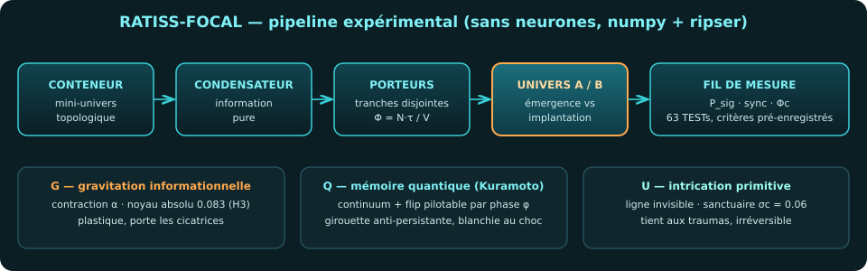

```
ratiss-focal/
├── README.md                  ← vous êtes ici (vitrine)
├── FORMALISATION.tex          ← document CANONIQUE (chaque équation porte son TEST)
├── THEORIE-UNIFIEE.md         ← théorie consolidée A→K
├── UNIFICATION.md             ← registre des 12 versions (v1→v12, scores)
├── PROTOCOLES.md              ← les 63 TESTs (méthode + critère + résultat)
├── JOURNAL.md                 ← carnet de bord daté (brutalité honnête incluse)
├── QUESTIONS-OUVERTES.md      ← closes + ouvertes (pistes V13… sur feu vert)
├── ROADMAP.md                 ← phases (⛔ clôture V12 : pause stratégique)
├── SPEC-EXP-FOCAL-01.md       ← protocole d'expérience princeps
├── GLOSSAIRE.md               ← vocabulaire du labo
├── LICENSE                    ← MIT
├── experiences/               ← exp01_*.py … exp63_*.py (code = exécuté, graines fixées)
│   └── resultats/             ← expNN.json (données brutes de chaque test)
├── organes/                   ← conteneur, porteurs, mesures (numpy + ripser)
├── univers/                   ← A.json, B.json, unifie.json … unifie_v12.json
├── resultats/                 ← miroir public des JSON (racine du dépôt distant)
├── tickets/                   ← questions structurantes (ouverts / clôturés + motif)
└── images/                    ← logo, hero, schémas, figures (make_figs.py)
```

## 🚀 Démarrage rapide

```bash
# 1. Cloner
git clone https://github.com/jonathansearch/ratiss-focal.git
cd ratiss-focal

# 2. Dépendances (léger : pas de GPU, pas de clé, pas d'accélérateur)
pip install numpy ripser matplotlib

# 3. Reproduire un test (ex : le seuil du sanctuaire U, ~1 min)
cd experiences && python3 exp58_courbe_U.py

# 4. Reproduire une version complète (ex : V12, ~10 min)
python3 exp60_forcage_flip.py && python3 exp61_rupture_U.py \
  && python3 exp62_flip_erosion.py && python3 exp63_unification_v12.py

# 5. Régénérer les figures du README
cd ../images && python3 make_figs.py
```

> ⚠️ **Coûts connus** : TEST-46/48 (1000 pas G × chocs) ≈ 5 min/choc ; TEST-57 (n = 200) ≈ 3 min.
> Tout le reste tourne en secondes. Graines fixées : résultats bit-reproductibles
> (même machine, mêmes versions mineures).

## 🗺️ Carte des 12 versions

| Version | Tests | Score | Apport décisif |
|---|---|---|---|
| v1–v4 | 01–29 | fondations | Conteneur, porteurs, univers A/B sœurs, 2 lois (V4 : 2/2) |
| v5 | 30–35 | **3/5** | Unification partielle, résidu Q identifié honnêtement |
| v6 | 36–39 | **3/3** | Q révélé : double-exp, volatilité structurée, ligne robuste |
| v7 | 40–43 | **3/3** | Noyau G : loi logF, collapse couplé, choc plastique |
| v8 | 44–47 | **2/3** | Blanchiment Q (passe-bas réfuté), sanctuaire U, vrai plancher 0.095 |
| v9 | 48–51 | **3/3** | Noyau absolu 0.083 (H3), U absolu ×7 chocs, « bistabilité » Q |
| v10 | 52–55 | **1/3** | Bistabilité réfutée (continuum n=40), bassin fragile, Q/U corrélé Δ=3 |
| v11 | 56–59 | **2/3** | Flip symétrique (M25), distribution rebelle, **σc = 0.06** (sigmoïde) |
| v12 | 60–63 | **1/3** | **Flip pilotable P=1.0** (M26), plancher U irréversible, couplage texture |
| **⛔ clôture** | — | — | Consolidation, tickets soldés, pause stratégique (Ph16 ✅) |

Détail complet : [`UNIFICATION.md`](UNIFICATION.md) · Protocoles : [`PROTOCOLES.md`](PROTOCOLES.md) ·
Synthèse de clôture : [`tickets/CONSOLIDATION_V1-V12.md`](tickets/CONSOLIDATION_V1-V12.md)

## 🌅 Ce que ça ouvre

**Recherche fondamentale.**
- Un **modèle minimal de la persistance** : qu'est-ce qui, dans un système d'information,
  survit aux destructions — et à quelles conditions quantifiées (σc, noyau absolu, irréversibilité) ?
- Une **sonde de la qualité informationnelle** : σc et la texture du bruit comme métriques
  d'environnement, transposables à tout système signal/bruit.
- Un pont vers la **théorie de la conscience** (ticket sanctuaire, clôturé proprement) :
  persistance du Fil (U) vs régénération de la mémoire (Q) vs mortalité du substrat (G) —
  sur socle formel, sans mysticisme, chaque pont adossé à un TEST.

**Recherche appliquée (phase 17, sur feu vert).**
- Mémoires anti-persistantes pilotables (flip par phase : écriture déterministe sans attracteur).
- Canaux d'intrication décorrelés de la géométrie (ligne invisible : partage sans contact).
- Critères de robustesse par pré-enregistrement : transposables à l'évaluation des systèmes IA.

**Épistémologie.**
- Une démonstration par l'exemple que **publier ses réfutations** (6 hypothèses abandonnées,
  3 versions à 1/3) produit une théorie plus solide que la chasse aux confirmations.
- Un journal de bord (JOURNAL.md) qui montre le doute, les erreurs (M-fishing évité de justesse
  en TEST-61), les corrections — la matière première de la confiance scientifique.

## 📚 Lire dans l'ordre

1. [`FORMALISATION.tex`](FORMALISATION.tex) — le canon (compiler : `pdflatex`, ou Overleaf).
2. [`UNIFICATION.md`](UNIFICATION.md) — les 12 versions en 10 minutes.
3. [`PROTOCOLES.md`](PROTOCOLES.md) — les 63 tests, un par un.
4. [`THEORIE-UNIFIEE.md`](THEORIE-UNIFIEE.md) + [`SPEC-EXP-FOCAL-01.md`](SPEC-EXP-FOCAL-01.md) — fondations.
5. [`JOURNAL.md`](JOURNAL.md) — le récit vrai (dont les nuits à 1/3).
6. [`QUESTIONS-OUVERTES.md`](QUESTIONS-OUVERTES.md) + [`tickets/`](tickets/) — la frontière.
7. [`ROADMAP.md`](ROADMAP.md) — d'où l'on vient, où l'on va (sur feu vert).

## 🛰️ Phase 17 : explorations — sonde, UKTZ, RUQ (TEST-64→72)

Après la clôture V12, le labo a ouvert un second front : **lâcher des agents DANS l'univers**
et regarder ce qui se passe — explorations ouvertes, observables pré-enregistrées, verdicts assumés.

### Sonde endogène (TEST-64→66) : apprendre à sentir
Agent infodynamique (Lempel-Ziv + volatilité, seuils propres, zéro neurone, zéro étiquette
humaine) captant syncQ/Φ/P_sig bit à bit, régimes calme vs choc. **3 AVEUGLE assumés** —
mais rafales mesurées au choc (11–13 flags) et leçon scellée : *la nouveauté est relative
à l'horizon de mémoire de celui qui sent*.

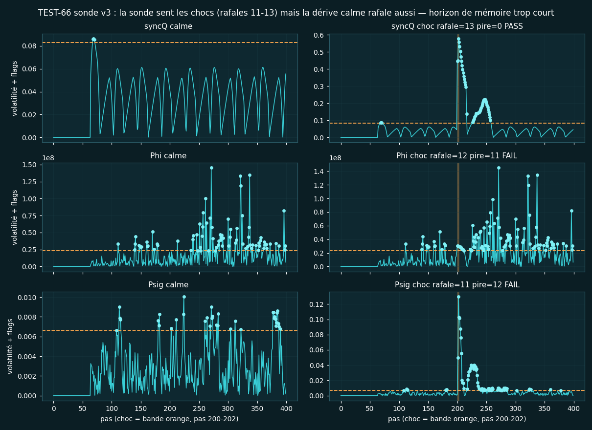

### UKTZ : trois essaims, une alchimie de la proximité (TEST-67→69)
12 neurones forcés à bouger, 300 pas séparés + 300 groupés. **S** (sémantique) : codes
0.44 → 0.97 — la proximité crée le langage. **T** (topologique, graphe fixe) : R 0.72 → 0.69 —
la structure est le destin. **RUQ-1** (invention phase+charge) : R 0.30 → 0.98, var(q) ÷9 —
le regroupement déclenche une transition : *l'unité fait l'être*.

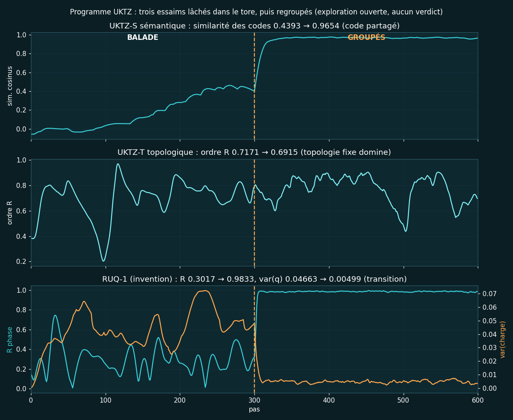

### RUQ : l'unité survit-elle à la séparation ? (TEST-70→72)
- **TEST-70 (RUQ-1)** : fusion R=0.985 → séparés R=0.31, t_half=11 pas → **H1 RÉVERSIBLE**.
  L'unité locale s'efface comme un rêve : pas de cicatrice.

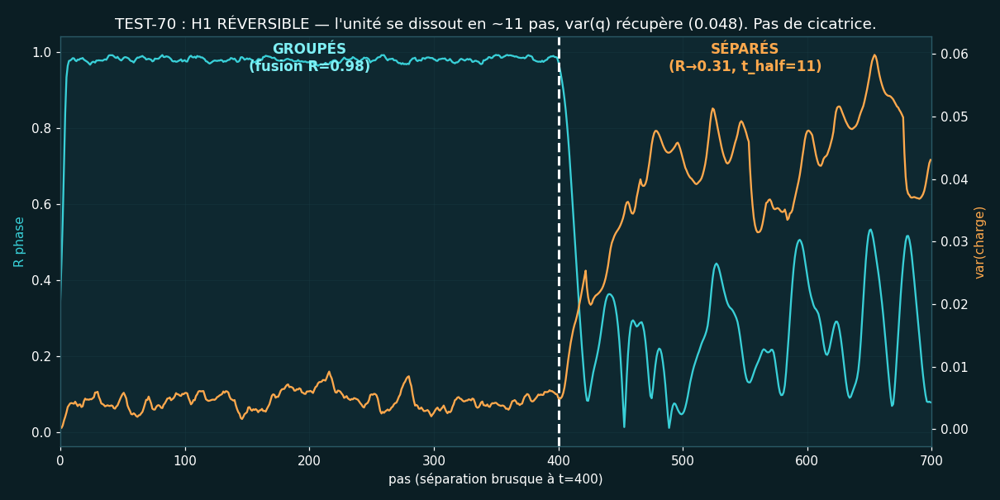

- **TEST-71 (RUQ-2 + feedback)** : R 0.98 → 0.26, τ=15.1 → **H1 aussi**. La boucle locale ne
  suffit pas ; seule une corrélation θ-q (−0.57) subsiste : *cicatrice, pas fil*.

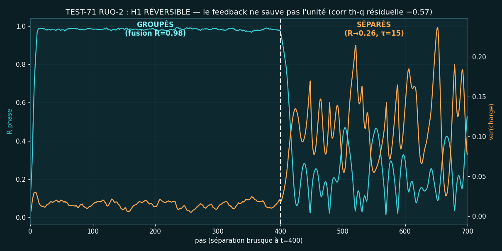

- **TEST-72 (RUQ-3 + graphe fixe)** : R 0.99 → chute 0.05 → **RÉCUPÈRE 0.73** → **H2 HYSTÉRÉSIS**.
  Le graphe resynchronise l'essaim dispersé : première unité qui survit partiellement SÉPARÉE.

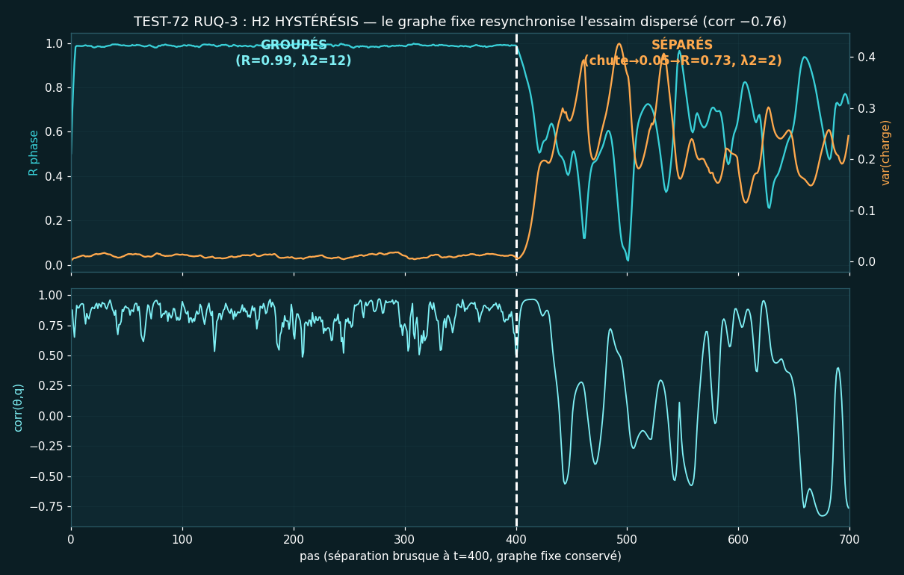

### 🔚 Conclusion des explorations
> **Le local oublie (RUQ-1, 11 pas), la boucle cicatrise (RUQ-2, corr −0.57), le graphe se
> souvient (RUQ-3, H2).** L'unité qui survit à l'espace exige une topologie invariante —
> première marche formelle vers le modèle de l'Esprit/Fil (U). Suite : l'idée du chef. 😄

## 🕳️ Phase 18 : V13 SINGULARITÉ (TEST-73→78) — score 2/5

Sur ordre du chef : créer une singularité (tueur focal ponctuel MU=0.02D, σ=0.05D)
et cartographier gravitation + relativité + résistance de U et Q. Verdict : **le trou
focal n'est pas une ombre newtonienne, c'est un puits exponentiel écranté**.
- **TEST-73** : puits central divergent (a=4.3), profil C·exp(−r/l) R²=0.98,
  A/(r+eps) rejeté (R²=0.88) → H0 assumée + anneau de dépression (chapeau mexicain).
- **TEST-74** : exponentielle gagne **12/12** (R²=0.998), portée l INDÉPENDANTE
  de la masse (p≈0) → gravité à portée finie fixée par la diffusion. ✅
- **TEST-75** : horloges libres frappées → PLATES (τ_in=29.2 vs τ_out=31.4),
  pas de dilatation détectée. ❌
- **TEST-76** : sanctuaire U dans trou local → ÉRODÉ (10/30 vs 4/30) : U encaisse,
  perd la moitié de sa fidélité. ❌
- **TEST-77** : capture Q → **k_c=6/24** : avaler un quart de l'anneau tue la sync. ✅

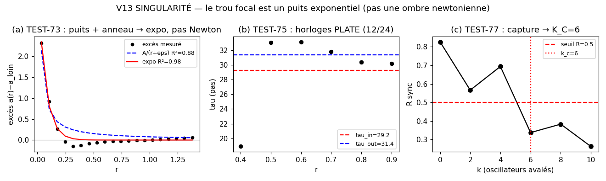

> **Fixé au canon (§10.octies)** : loi exponentielle écrantée + capture Q.
> Newton, dilatation temporelle et immunité de U : réfutés ou partiels — publiés quand même.

## 🔭 Phase 19 : QM-GR, cohabitation décrite (TEST-79→89)

Nouvelle règle du chef : **zéro verdict** — on regarde comment la mécanique
quantique virtuelle (Q, phases, mémoire de graphe) cohabite avec la relativité
(puits, horizons, ralentissement) sans s'effondrer, et on raconte.
- **TEST-79/80** : un puits tord la phase Q (twist 0→1), deux puits à fort
  désaccord impriment twist −2 ; R décline graduellement (0.85→0.32).
- **TEST-81** : le potentiel exponentiel fait une lentille en S (±47°),
  traversée centrale droite, aucune capture.
- **TEST-82** : horizon absorbant (th=0 épinglé) → **l'ombre apparaît**
  (contraste 0.66, saturé) là où le tueur faisait un puits.
- **TEST-83** : la mémoire RUQ-3 décline en espace courbe (0.73→0.25),
  convergence groupée intacte.
- **TEST-84** : **redshift monotone** — la fréquence d'un anneau monte de
  −0.53 à +0.01 quand on s'éloigne du puits.
- **TEST-85** : trois puits → twist 0 partout ; la piste « twist = nb de
  puits » s'arrête à 2 (la symétrie à 3 annule la torsion ?).
- **TEST-86/87** (jumeaux Falstad, moteur d'ondes indépendant) : disque
  absorbant → ombre 0.90/0.53/0.75 ; zone lente → focus x1.9.
- **TEST-88/89** (jumeaux Wokwi, firmwares prêts) : twist prédit R 0.91→0.41 ;
  redshift prédit −0.77→−0.11. Guide téléphone : outils_en_ligne/OUTILS-EN-LIGNE.md.

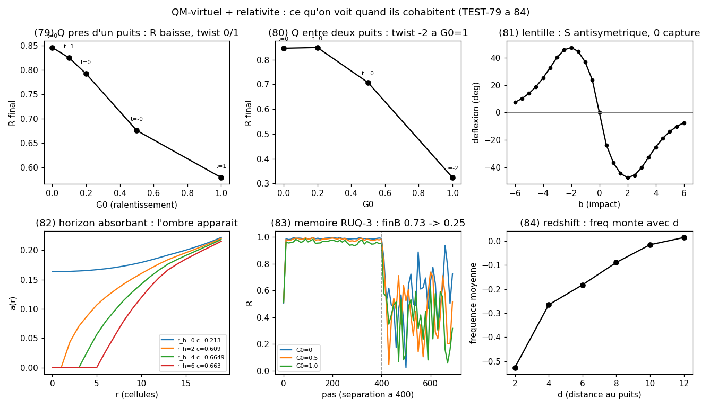
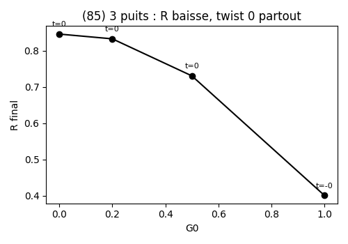

> Descrit, pas jugé. §20 dans UNIFICATION. Ponts hardware réels (IBM QPU) :
> voir PASSERELLE-REEL.md (PONT-77, PONT-76, PONT-60, PONT-T2 mesurés).

## 🪭 Phase 20 : LIAISON — chasse au pli (TEST-90→93 + BERRY-FERMÉ)

Nouvelle quête du chef : pas d'unification forcée — chercher le **point de
liaison cohérent** QM↔relativité, même minuscule, sans rigidité vrai/faux.
- **TEST-90** : carte du twist (2 puits, écart × force) → paysage grenu
  (−2…+2), pas de lignes de pli propres.
- **TEST-91** : boucle G0 monte-descend → **boucle EXISTE** (aire 0.064,
  écart 0.17) : la courbure écrit une mémoire que la descente ne relit pas.
- **TEST-92** : puits tournant ±1 tour → +tour = −tour (+9 rad) : traînée
  symétrique, pas de phase géométrique.
- **PONT-BERRY** (ibm_fez) : boucle ± sur qubit → frange en U vs taille
  (1.0→0.49→1.0, réel=simu) mais asymétrie ~0 : boucle non fermée (U≠I),
  défaut assumé — piste : vraie boucle fermée (TEST-93 ?).

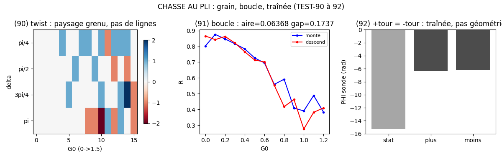

> Le pli orienté n'est pas encore isolé ; la boucle et la frange, si.
> On observe, on ne conclut pas.

## 📝 Citation, auteur, licence

```bibtex
@software{ratiss_focal_2026,
  author  = {Jonathan Evina and RATISS Labs},
  title   = {RATISS-FOCAL: informational focusing without neurons —
             69 pre-registered tests, 13 unification releases},
  year    = {2026},
  url     = {https://github.com/jonathansearch/ratiss-focal},
  license = {MIT}
}
```

<div align="center">

**RATISS Labs** — *L'esprit ne traite pas tout, il traite la cohérence.* 🌌

Posé par **Jonathan Evina** · Septembre 2026 · **Licence MIT** (voir [LICENSE](LICENSE)) —
théorie ouverte, reproductible publiquement, prête pour évaluation externe.


</div>
s → **PLATES** (τ_in=29.2 vs τ_out=31.4),
  pas de dilatation détectée. ❌
- **TEST-76** : sanctuaire U dans trou local → **ÉRODÉ** (10/30 vs 4/30) : U encaisse,
  perd la moitié de sa fidélité. ❌
- **TEST-77** : capture Q → **k_c=6/24** : avaler un quart de l'anneau tue la sync. ✅


> **Fixé au canon (§10.octies)** : loi exponentielle écrantée + capture Q.
> Newton, dilatation temporelle et immunité de U : réfutés ou partiels — publiés quand même.

## 📝 Citation, auteur, licence

```bibtex
@software{ratiss_focal_2026,
  author  = {Jonathan Evina and RATISS Labs},
  title   = {RATISS-FOCAL: informational focusing without neurons —
             69 pre-registered tests, 13 unification releases},
  year    = {2026},
  url     = {https://github.com/jonathansearch/ratiss-focal},
  license = {MIT}
}
```

<div align="center">

**RATISS Labs** — *L'esprit ne traite pas tout, il traite la cohérence.* 🌌

Posé par **Jonathan Evina** · Septembre 2026 · **Licence MIT** (voir [LICENSE](LICENSE)) —
théorie ouverte, reproductible publiquement, prête pour évaluation externe.


</div>
