<div align="center">


# 🎯 RATISS-FOCAL — Informational focusing

**Does coherence emerge from information? Here, we do not speculate: we measure.**

[](LICENSE)
[](PROTOCOLES.md)
[](UNIFICATION.md)
[](organes/)
[](organes/)

*By **RATISS Labs** — Jonathan Evina · MIT License · Total public reproducibility*

</div>


> **Abstract (EN).** *Does coherence emerge from information? RATISS-FOCAL is an open experimental
> program (69 pre-registered computational tests plus 15 open explorations, 13 unification releases) probing whether coherent
> structure can arise from pure information — with zero neurons. Three sectors are characterised:
> **G** (informational gravity: plastic, scarring, saturating on an absolute core of 0.083),
> **Q** (quantum memory: an anti-persistent continuum, phase-steerable), and **U** (primitive
> entanglement: a sanctuary robust to discrete shocks, eroding past ambient noise σc = 0.06,
> irreversibly). Every equation ships with its test. Failures are published, never hidden. MIT.*

---

## 📖 Table of contents

1. [The question](#-the-question)
2. [The three pillars: G, Q, U](#-the-three-pillars--g-q-u)
3. [Major results (real data)](#-major-results-real-data)
4. [Method: pre-registered rigor](#-method--pre-registered-rigor)
5. [Repository architecture](#-repository-architecture)
6. [Quick start](#-quick-start)
7. [Map of the 12 releases](#-map-of-the-12-releases)
8. [What this opens](#-what-this-opens)
9. [Read in order](#-read-in-order)
10. [Phase 17: explorations](#-phase-17--explorations--probe-uktz-ruq-test-6472)
11. [Phase 18: V13 singularity](#-phase-18--v13-singularity-test-7378--score-25)
12. [Phase 19: QM-GR, cohabitation described](#-phase-19--qm-gr-cohabitation-described-test-7989)
13. [Phase 20: LIAISON — fold hunt](#-phase-20--liaison--fold-hunt-test-9093--berry-fermé)
14. [Phase 21: QM-GR synthesis](#phase-21--qm-gr-synthesis-test-94)
15. [Citation, author, license](#-citation-author-license)

---

## ❓ The question

> **Does coherence emerge from information?**

Not from matter. Not from neural computation. From **pure information**: points, links,
concentrations — observed through a topological microscope (persistent homology),
without a single neuron.

If a coherent structure **appears, persists and resists destructions** in this minimal
medium, then coherence is not an accident of complexity: it is a **property
of information itself**.

This repository is the laboratory where this question was asked **63 times**, with criteria
written **before** each measurement — and where the answers, good or bad, were all published.

## 🔱 The three pillars: G, Q, U

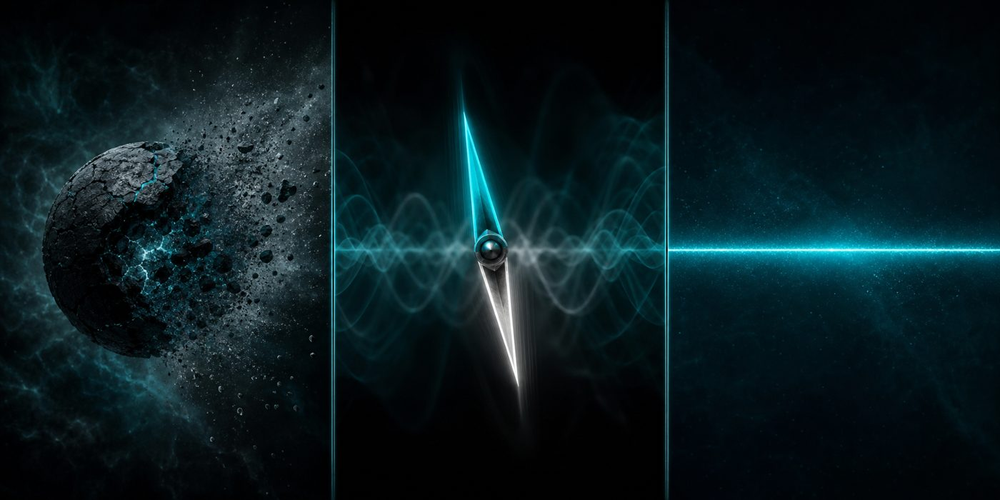

| Sector | Nature | Measured personality |
|---|---|---|
| **G** — informational gravity | α contraction of a torus of points | **Plastic and mortal.** Collapses at the first shock (0.345 → 0.097), bleeds slowly (τ ≈ 400 steps), but **saturates on an indestructible absolute core: 0.083**. Carries its scars eternally. |
| **Q** — quantum memory (Kuramoto ring) | Synchronization of 24 oscillators | **Anti-persistent weathervane.** No attractors: continuum [0.76, 0.91], symmetric contrarian flip at every shock — but **steerable to P = 1.0 by the injected absolute phase**. The shock whitens it (entropic reset), it regenerates. |
| **U** — primitive entanglement | Invisible line: non-geometric coincidences | **Conditional sanctuary.** Unchanged under 7 cumulative shocks (28/30, Δ = 0) while G dies at −72%. But sensitive to **ambient noise**: threshold **σc = 0.06** (sigmoid R² = 0.964), partial floor ~30%, **irreversible erosion**. Reads the *texture* of the noise, not just its volume. |

**In one sentence:** G is the mortal terminal, Q the regenerative memory, U the Thread that persists —
as long as the environment stays below σc.

## 📊 Major results (real data)

All the figures below are generated **from the repository's result JSONs**
(script: `images/make_figs.py`).

### 1. The U sanctuary has a threshold: σc = 0.06

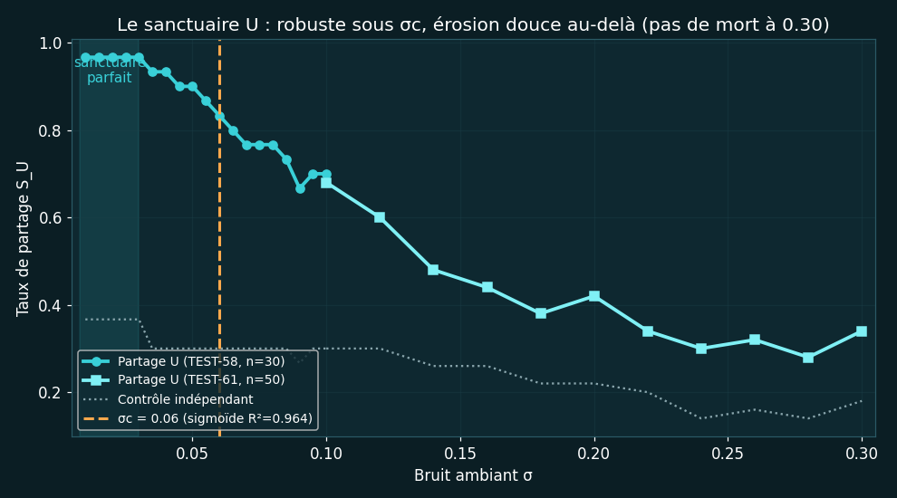

- **TEST-49**: 28/30 identical over 7 levels of cumulative shocks (Δ = 0) → absolute sanctuary vs traumas.
- **TEST-58**: scan σ ∈ [0.01, 0.10] → sigmoid R² = 0.964, σc = 0.06, plateau 29/30 → 21/30.
- **TEST-61**: no death up to σ = 0.30 (floor ~30% vs ~16% control) but **irreversible**.
- **TEST-62**: at identical σ, the HIGH structure pushes U to +2/+4 → **U reads the texture of the noise**.

### 2. G saturates on an absolute core: 0.083

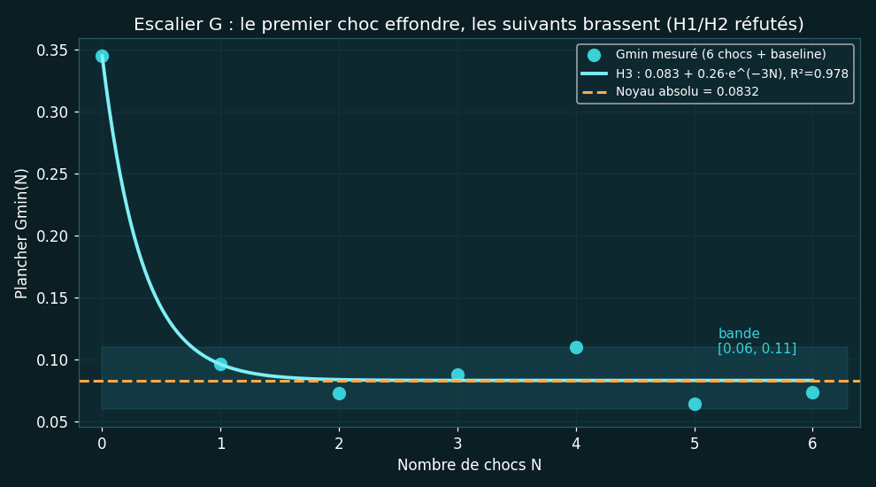

- **TEST-48**: 6 cumulative shocks → **H3 saturating R² = 0.978**, Gmin(N) = 0.083 + 0.26·e^(−3N).
- The first shock does all the collapse; the following ones shuffle within a band [0.06, 0.11].
- H1 (linear) and H2 (exponential) **refuted**: no breaking to zero.

### 3. The Q flip obeys phase: P = 1.0

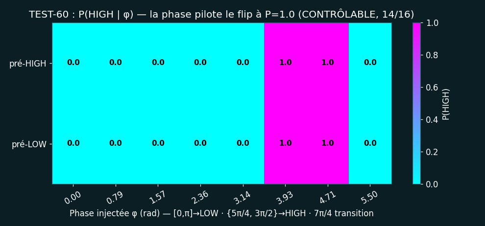

- **TEST-60**: φ_inj ∈ [0, π] → LOW, φ ∈ {5π/4, 3π/2} → HIGH, **P = 1.0 in both pre-shock arms** (CONTROLLABLE, 14/16).
- 7π/4 = transition zone (50% ambiguous): the boundary of control is visible.
- Anti-persistence has a steering wheel: the **absolute phase** (symmetry broken by spatial anchors).

### 4. Q has no attractors: continuum cleanly refuted

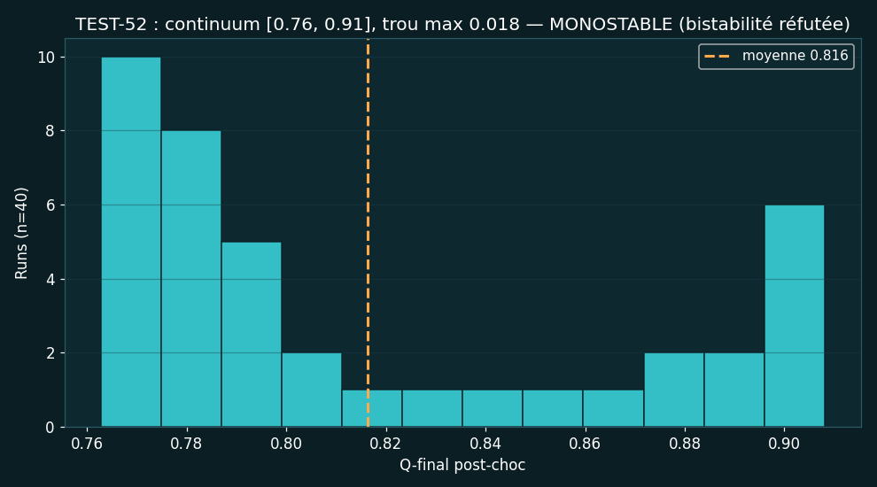

- **TEST-50** (n = 6) suggested a bistability 0.78/0.87 → **TEST-52** (n = 40) refutes it: continuum
  [0.76, 0.91], max hole 0.018 (MONOSTABLE).
- **TEST-53**: P_switch = 1.0 from 0.25× the standard intensity → basin with no depth.
- **TEST-56**: **symmetric** flip (HIGH→0.77, LOW→0.84) → no drift, no Q̄ equilibrium.
- *Lesson sealed in marble: replicate before naming.*

### Other sealed laws

| Law | Test | Measurement |
|---|---|---|
| Floor G(α, σ, N) = exp(−0.29 − 7.16α − 6.59σ + 0.0012N) | TEST-40 | R² = 0.920 |
| G double-exp reconstruction, slow τ ≈ 400 steps, true floor 0.095 | TEST-46 | R² = 0.902 |
| Q double-exp sync (k₁ = 0.098 fast, k₂ = 0.001 slow) | TEST-36 | R² = 0.968 |
| Structured Q volatility (slope −0.72, ac1 0.63) | TEST-37 | signal, not noise |
| Proximity-Condensation (ρc = 8.01 extracted, never assumed) | TEST-27 | sync 0.98 vs 0.11 |
| Post-collapse resilience (links: R = 1.023 absolute) | TEST-28/25 | real purification |

## 🔬 Method: pre-registered rigor

What distinguishes this repository is not that it is right — it is **that it cannot cheat**:

1. **Criterion written before the measurement.** Every TEST declares its success rule in its docstring
   *before* execution. No threshold adjusted after the fact.
2. **Mandatory falsifiability.** Every test has at least two documented possible outcomes
   (e.g.: SANCTUARY / SATELLITE / COLLAPSED). A test that cannot fail is forbidden.
3. **Failures published.** 1/3, 2/3: partial scores are sealed as is. Refuted hypotheses
   (bistability, entropic bias, catastrophic breaking, low-pass filter, H1/H2…)
   are listed in `tickets/CONSOLIDATION_V1-V12.md` — **do not reopen without new facts**.
4. **No M-fishing.** Protocol modifications (M1→M26) are declared, dated,
   justified — and a criterion is **never** rewritten to make it pass (cf. TEST-61: owned MIXED).
5. **Zero neurons.** `numpy + ripser` are enough. If coherence emerges here, it owes nothing
   to deep learning.
6. **Public reproducibility = credibility.** MIT, data + code + journal, fixed seed everywhere.

## 🗂️ Repository architecture

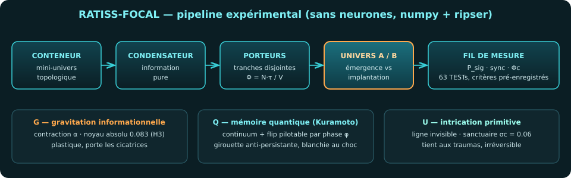

```
ratiss-focal/
├── README.md                  ← you are here (showcase)
├── FORMALISATION.tex          ← CANONICAL document (every equation carries its TEST)
├── THEORIE-UNIFIEE.md         ← consolidated theory A→K
├── UNIFICATION.md             ← registry of the 12 releases (v1→v12, scores)
├── PROTOCOLES.md              ← the 63 TESTs (method + criterion + result)
├── JOURNAL.md                 ← dated logbook (honest brutality included)
├── QUESTIONS-OUVERTES.md      ← closed + open (V13 tracks… on green light)
├── ROADMAP.md                 ← phases (⛔ V12 closure: strategic pause)
├── SPEC-EXP-FOCAL-01.md       ← princeps experiment protocol
├── GLOSSAIRE.md               ← the lab's vocabulary
├── LICENSE                    ← MIT
├── experiences/               ← exp01_*.py … exp63_*.py (code = executed, fixed seeds)
│   └── resultats/             ← expNN.json (raw data of each test)
├── organes/                   ← container, carriers, measurements (numpy + ripser)
├── univers/                   ← A.json, B.json, unifie.json … unifie_v12.json
├── resultats/                 ← public mirror of the JSONs (root of the remote repository)
├── tickets/                   ← structuring questions (open / closed + reason)
└── images/                    ← logo, hero, diagrams, figures (make_figs.py)
```

## 🚀 Quick start

```bash
# 1. Clone
git clone https://github.com/jonathansearch/ratiss-focal.git
cd ratiss-focal

# 2. Dependencies (light: no GPU, no key, no accelerator)
pip install numpy ripser matplotlib

# 3. Replay a test (e.g.: the U sanctuary threshold, ~1 min)
cd experiences && python3 exp58_courbe_U.py

# 4. Replay a full release (e.g.: V12, ~10 min)
python3 exp60_forcage_flip.py && python3 exp61_rupture_U.py \
  && python3 exp62_flip_erosion.py && python3 exp63_unification_v12.py

# 5. Regenerate the README figures
cd ../images && python3 make_figs.py
```

> ⚠️ **Known costs**: TEST-46/48 (1000 G steps × shocks) ≈ 5 min/shock; TEST-57 (n = 200) ≈ 3 min.
> Everything else runs in seconds. Fixed seeds: bit-reproducible results
> (same machine, same minor versions).

## 🗺️ Map of the 12 releases

| Release | Tests | Score | Decisive contribution |
|---|---|---|---|
| v1–v4 | 01–29 | foundations | Container, carriers, sister universes A/B, 2 laws (V4: 2/2) |
| v5 | 30–35 | **3/5** | Partial unification, Q residual honestly identified |
| v6 | 36–39 | **3/3** | Q revealed: double-exp, structured volatility, robust line |
| v7 | 40–43 | **3/3** | G core: logF law, coupled collapse, plastic shock |
| v8 | 44–47 | **2/3** | Q whitening (low-pass refuted), U sanctuary, true floor 0.095 |
| v9 | 48–51 | **3/3** | Absolute core 0.083 (H3), U absolute ×7 shocks, Q "bistability" |
| v10 | 52–55 | **1/3** | Bistability refuted (continuum n=40), fragile basin, Q/U correlated Δ=3 |
| v11 | 56–59 | **2/3** | Symmetric flip (M25), rebel distribution, **σc = 0.06** (sigmoid) |
| v12 | 60–63 | **1/3** | **Steerable flip P=1.0** (M26), irreversible U floor, texture coupling |
| **⛔ closure** | — | — | Consolidation, tickets settled, strategic pause (Ph16 ✅) |

Full detail: [`UNIFICATION.md`](UNIFICATION.md) · Protocols: [`PROTOCOLES.md`](PROTOCOLES.md) ·
Closure synthesis: [`tickets/CONSOLIDATION_V1-V12.md`](tickets/CONSOLIDATION_V1-V12.md)

## 🌅 What this opens

**Fundamental research.**
- A **minimal model of persistence**: what, in an information system,
  survives destructions — and under what quantified conditions (σc, absolute core, irreversibility)?
- A **probe of informational quality**: σc and the texture of the noise as environment metrics,
  transferable to any signal/noise system.
- A bridge towards **consciousness theory** (sanctuary ticket, cleanly closed):
  persistence of the Thread (U) vs regeneration of memory (Q) vs mortality of the substrate (G) —
  on a formal base, with no mysticism, every bridge backed by a TEST.

**Applied research (phase 17, on green light).**
- Steerable anti-persistent memories (flip by phase: deterministic writing without attractor).
- Entanglement channels decorrelated from geometry (invisible line: sharing without contact).
- Robustness criteria by pre-registration: transferable to the evaluation of AI systems.

**Epistemology.**
- A demonstration by example that **publishing your refutations** (6 abandoned hypotheses,
  3 releases at 1/3) produces a theory more solid than the hunt for confirmations.
- A logbook (JOURNAL.md) that shows doubt, errors (M-fishing narrowly avoided
  in TEST-61), corrections — the raw material of scientific trust.

## 📚 Read in order

1. [`FORMALISATION.tex`](FORMALISATION.tex) — the canon (compile: `pdflatex`, or Overleaf).
2. [`UNIFICATION.md`](UNIFICATION.md) — the 12 releases in 10 minutes.
3. [`PROTOCOLES.md`](PROTOCOLES.md) — the 63 tests, one by one.
4. [`THEORIE-UNIFIEE.md`](THEORIE-UNIFIEE.md) + [`SPEC-EXP-FOCAL-01.md`](SPEC-EXP-FOCAL-01.md) — foundations.
5. [`JOURNAL.md`](JOURNAL.md) — the true story (including the nights at 1/3).
6. [`QUESTIONS-OUVERTES.md`](QUESTIONS-OUVERTES.md) + [`tickets/`](tickets/) — the frontier.
7. [`ROADMAP.md`](ROADMAP.md) — where we come from, where we go (on green light).

## 🛰️ Phase 17: explorations — probe, UKTZ, RUQ (TEST-64→72)

After the V12 closure, the lab opened a second front: **dropping agents INTO the universe**
and watching what happens — open explorations, pre-registered observables, owned verdicts.

### Endogenous probe (TEST-64→66): learning to feel
Infodynamic agent (Lempel-Ziv + volatility, own thresholds, zero neuron, zero human label)
captor of syncQ/Φ/P_sig bit by bit, calm vs shock regimes. **3 owned BLIND** —
but bursts measured at the shock (11–13 flags) and lesson sealed: *novelty is relative
to the memory horizon of the one who feels*.

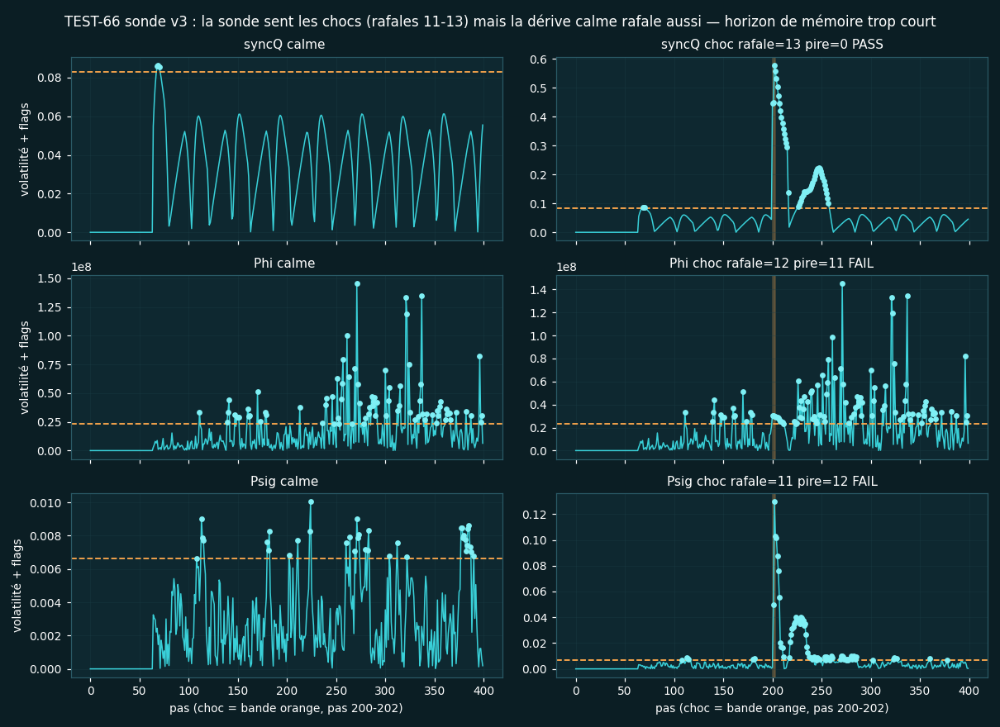

### UKTZ: three swarms, an alchemy of proximity (TEST-67→69)
12 neurons forced to move, 300 steps separated + 300 grouped. **S** (semantic): codes
0.44 → 0.97 — proximity creates language. **T** (topological, fixed graph): R 0.72 → 0.69 —
structure is destiny. **RUQ-1** (phase+charge invention): R 0.30 → 0.98, var(q) ÷9 —
grouping triggers a transition: *unity makes the being*.

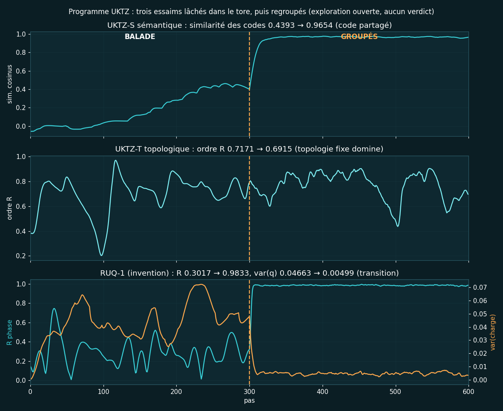

### RUQ: does unity survive separation? (TEST-70→72)
- **TEST-70 (RUQ-1)**: fusion R=0.985 → separated R=0.31, t_half=11 steps → **H1 REVERSIBLE**.
  Local unity fades like a dream: no scar.

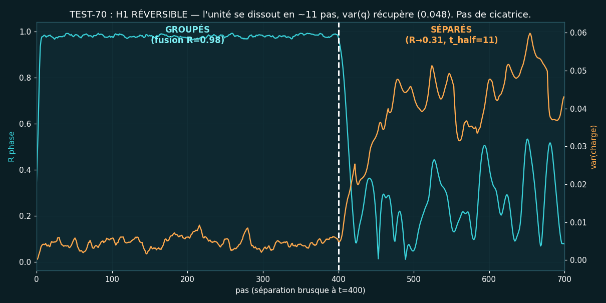

- **TEST-71 (RUQ-2 + feedback)**: R 0.98 → 0.26, τ=15.1 → **H1 too**. The local loop is
  not enough; only a θ-q correlation (−0.57) remains: *scar, not thread*.

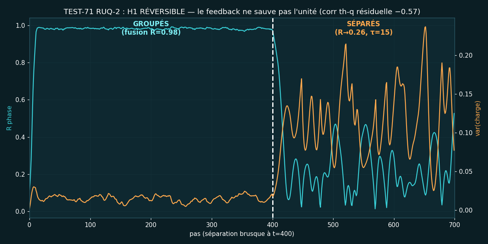

- **TEST-72 (RUQ-3 + fixed graph)**: R 0.99 → fall 0.05 → **RECOVERS 0.73** → **H2 HYSTERESIS**.
  The graph resynchronizes the dispersed swarm: first unity that partially survives SEPARATED.

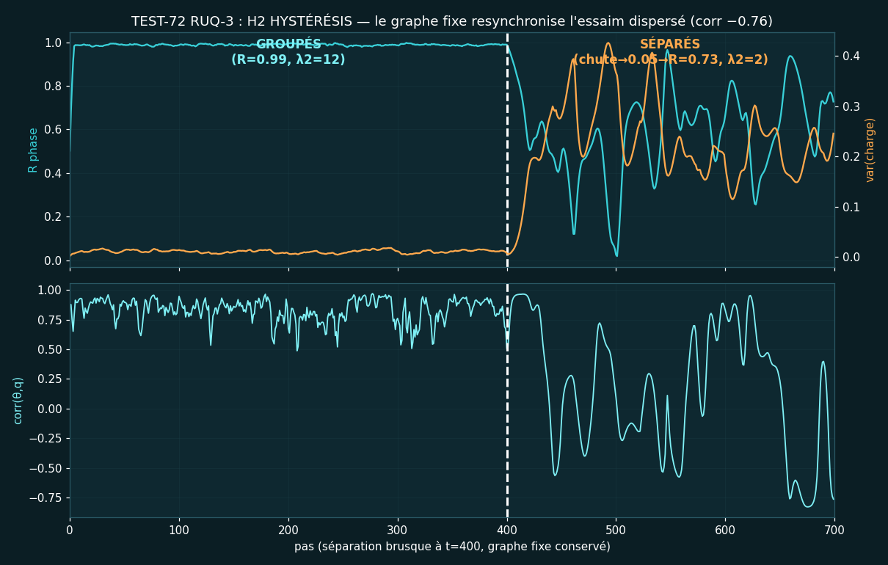

### 🔚 Conclusion of the explorations
> **The local forgets (RUQ-1, 11 steps), the loop scars (RUQ-2, corr −0.57), the graph
> remembers (RUQ-3, H2).** Unity that survives space demands an invariant topology —
> first formal step towards the Mind/Thread model (U). Next: the chief's idea. 😄

## 🕳️ Phase 18: V13 SINGULARITY (TEST-73→78) — score 2/5

On the chief's order: create a singularity (punctual focal killer MU=0.02D, σ=0.05D)
and map gravity + relativity + resistance of U and Q. Verdict: **the focal
hole is not a Newtonian shadow, it is a screened exponential well**.
- **TEST-73**: divergent central well (a=4.3), C·exp(−r/l) profile R²=0.98,
  A/(r+eps) rejected (R²=0.88) → owned H0 + depression ring (Mexican hat).
- **TEST-74**: exponential wins **12/12** (R²=0.998), range l INDEPENDENT
  of the mass (p≈0) → gravity with finite range fixed by diffusion. ✅
- **TEST-75**: free clocks struck → FLAT (τ_in=29.2 vs τ_out=31.4),
  no dilation detected. ❌
- **TEST-76**: U sanctuary in a local hole → **ERODED** (10/30 vs 4/30): U takes the hit,
  loses half of its fidelity. ❌
- **TEST-77**: Q capture → **k_c=6/24**: swallowing a quarter of the ring kills sync. ✅

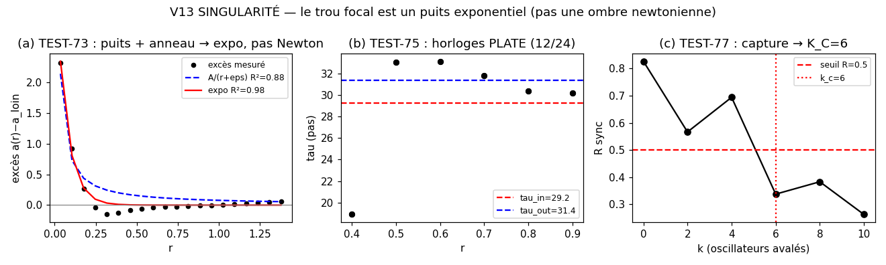

> **Pinned to the canon (§10.octies)**: screened exponential law + Q capture.
> Newton, time dilation and U immunity: refuted or partial — published anyway.

## 🔭 Phase 19: QM-GR, cohabitation described (TEST-79→89)

New rule from the chief: **zero verdict** — we watch how virtual quantum
mechanics (Q, phases, graph memory) cohabits with relativity
(wells, horizons, slowdown) without collapsing, and we tell the tale.
- **TEST-79/80**: one well twists the Q phase (twist 0→1), two wells with strong
  detuning print twist −2; R declines gradually (0.85→0.32).
- **TEST-81**: the exponential potential makes an S-lens (±47°),
  straight central crossing, no capture.
- **TEST-82**: absorbing horizon (th=0 pinned) → **the shadow appears**
  (contrast 0.66, saturated) where the killer made a well.
- **TEST-83**: RUQ-3 memory declines in curved space (0.73→0.25),
  grouped convergence intact.
- **TEST-84**: **monotone redshift** — a ring's frequency climbs from
  −0.53 to +0.01 as you move away from the well.
- **TEST-85**: three wells → twist 0 everywhere; the "twist = number of
  wells" track stops at 2 (3-way symmetry cancels the twist?).
- **TEST-86/87** (Falstad twins, independent wave engine): absorbing
  disk → shadow 0.90/0.53/0.75; slow zone → focus ×1.9.
- **TEST-88/89** (Wokwi twins, firmwares ready): twist predicted R 0.91→0.41;
  redshift predicted −0.77→−0.11. Phone guide: outils_en_ligne/OUTILS-EN-LIGNE.md.

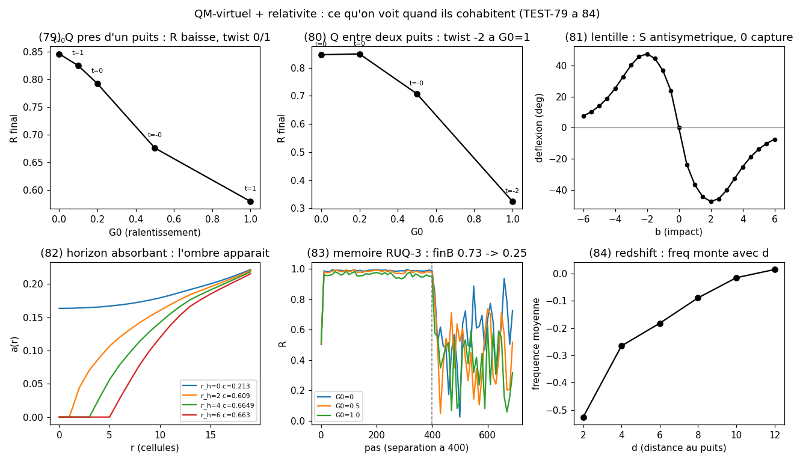
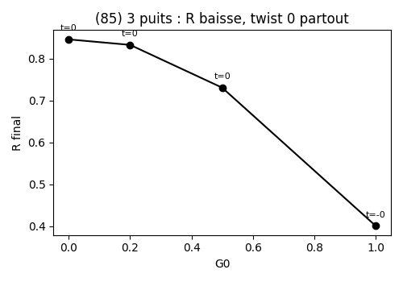

> Described, not judged. §20 in UNIFICATION. Real hardware bridges (IBM QPU):
> see PASSERELLE-REEL.md (PONT-77, PONT-76, PONT-60, PONT-T2 measured).

## 🪭 Phase 20: LIAISON — fold hunt (TEST-90→93 + BERRY-FERMÉ)

New quest from the chief: no forced unification — look for the **coherent
binding point** QM↔relativity, even tiny, with no true/false rigidity.
- **TEST-90**: twist map (2 wells, gap × force) → grainy landscape
  (−2…+2), no clean fold lines.
- **TEST-91**: G0 up-down loop → **loop EXISTS** (area 0.064,
  gap 0.17): curvature writes a memory that the way down does not read back.
- **TEST-92**: rotating well ±1 turn → +turn = −turn (+9 rad): symmetric
  wake, no geometric phase.
- **PONT-BERRY** (ibm_fez): ± loop on a qubit → U-shaped fringe vs size
  (1.0→0.49→1.0, real=sim) but asymmetry ~0: loop not closed (U≠I),
  owned defect.
- **TEST-93**: (G0,c) cycle CLOSED ± → Δ=−0.221 rad only:
  the parameters close up, the state does not come back (R_diff 0.25).
- **BERRY-FERMÉ** (ibm_marrakesh): closed ± loop (leak ~1e-33,
  γ=−φ/2) → S readout: **0.966 vs 0.028 at φ=π** (real≈sim):
  **direction matters — the oriented fold is measured.**

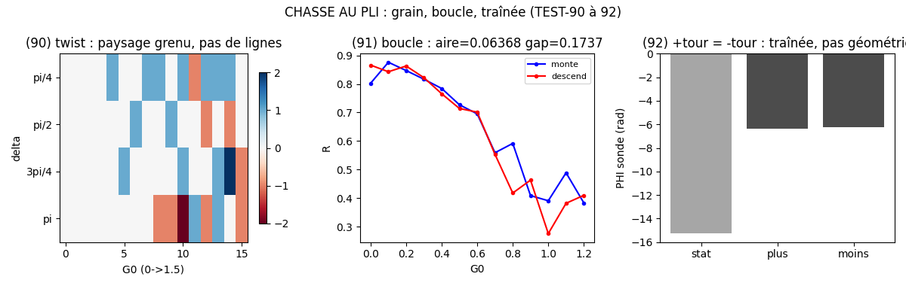

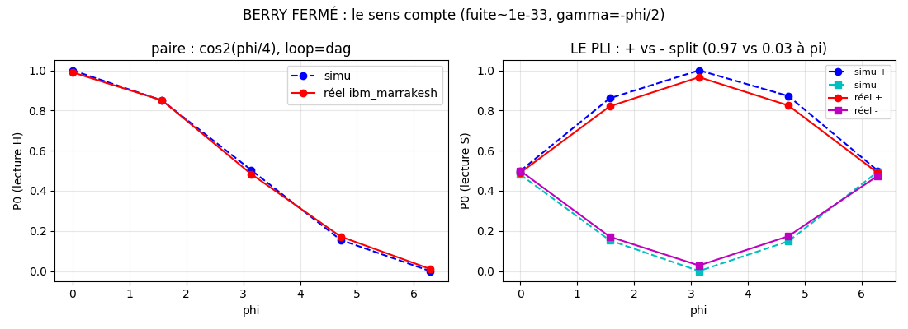

> The oriented fold is isolated where the loop really closes.
> Hysteresis (open state) and Berry (closed state): two faces of the fold.

## Phase 21: QM-GR SYNTHESIS (TEST-94)

First computation of the model that demands both scales: two-height
superposition (internal spread sw, QM pillar) × local clocks of the well
(redshift, GR pillar). τ=√2/(sw·|Δf|) to within ~8% (18 cases); τ=∞ if one pillar
removed (30 controls).

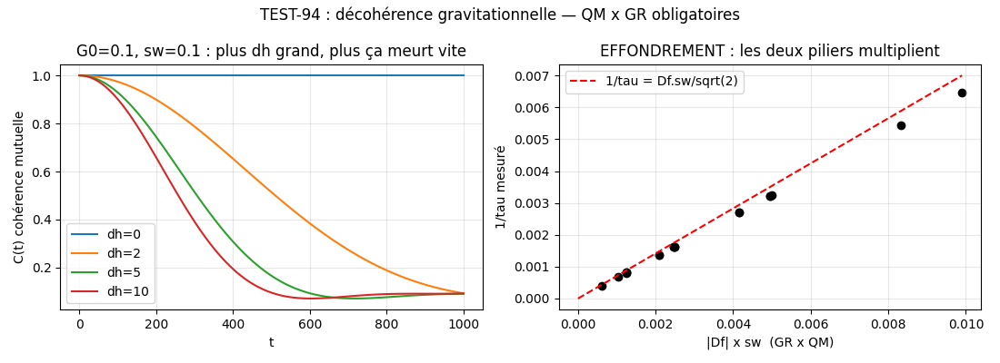

## 📝 Citation, author, license

```bibtex
@software{ratiss_focal_2026,
  author  = {Jonathan Evina and RATISS Labs},
  title   = {RATISS-FOCAL: informational focusing without neurons —
             69 pre-registered tests, 13 unification releases},
  year    = {2026},
  url     = {https://github.com/jonathansearch/ratiss-focal},
  license = {MIT}
}
```

<div align="center">

**RATISS Labs** — *The mind does not process everything, it processes coherence.* 🌌

Set in motion by **Jonathan Evina** · September 2026 · **MIT License** (see [LICENSE](LICENSE)) —
open theory, publicly reproducible, ready for external evaluation.


</div>


